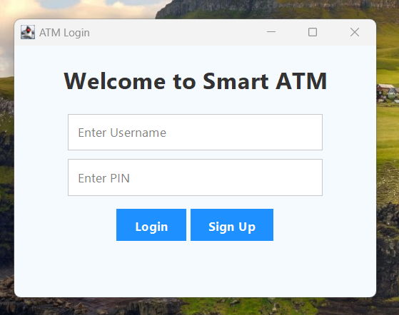
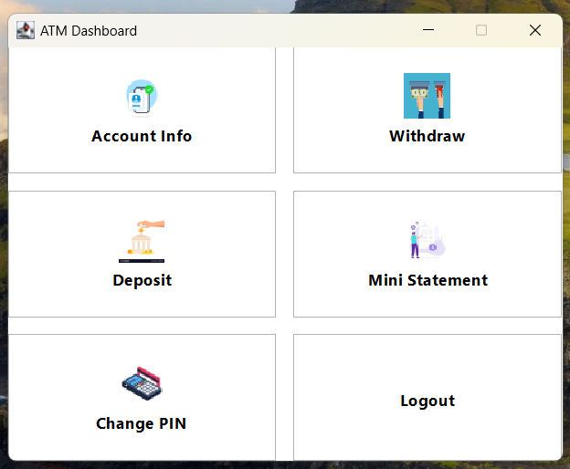
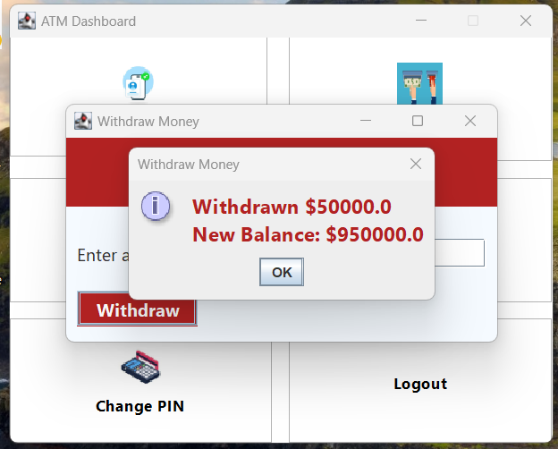
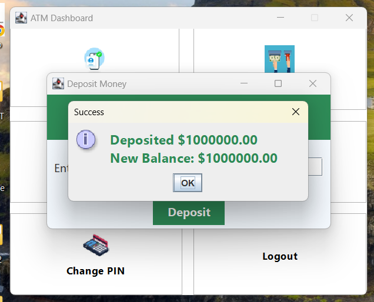
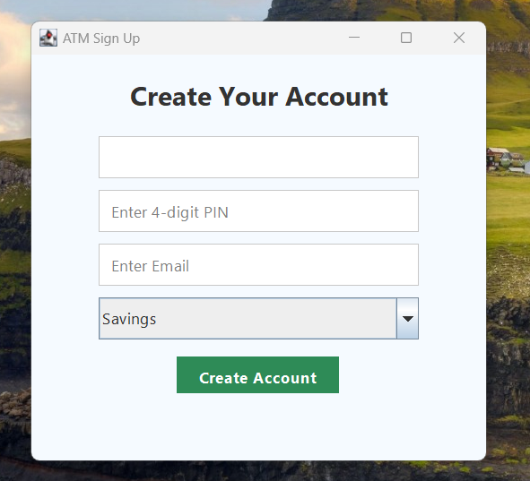
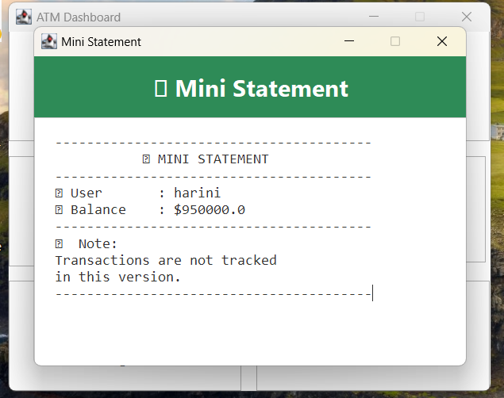
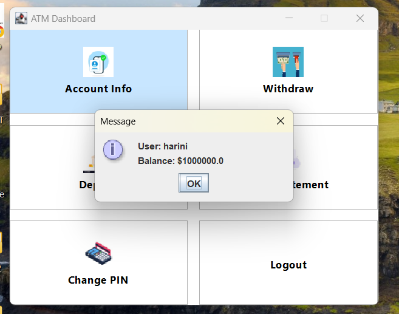
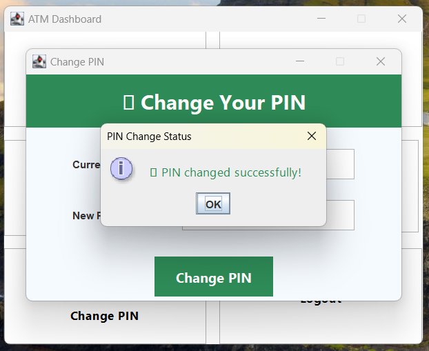

# 💳 ATM Simulator System - Java Swing GUI Project

Welcome to the **ATM Simulator System**, a desktop-based banking application built using **Java Swing GUI**. This project mimics the core functionalities of a real ATM system, allowing users to **login**, **check balance**, **withdraw**, **deposit**, and **view transaction history**.

---

## 🎯 Features

- 🔐 Secure login system
- 🏦 View current account balance
- 💸 Deposit and withdraw funds
- 📜 Display transaction history
- 🖱️ Intuitive and user-friendly Swing-based GUI

---

## 📽️ Demo Video

▶️ **[[Click here to watch the demo video](https://drive.google.com/file/d/1nxdogXdSymkJ2PCAn7q66j-CKQsrMlqF/view?usp=sharing)]()**  


---

## 🖼️ Screenshots










> Place all screenshots inside a folder named **`images/`** in your GitHub repository root.

---

## 🛠️ Technologies Used

- **Java (JDK 8+)**
- **Swing** for GUI design
- **AWT** for layout management
- **Java IO/File Handling** for basic data storage

---

## 🚀 How to Run the Project

1. **Clone this repository**  
   ```bash
   git clone https://github.com/kanaga-m/ATM-Stimulator-System.git
   cd ATM-Stimulator-System
